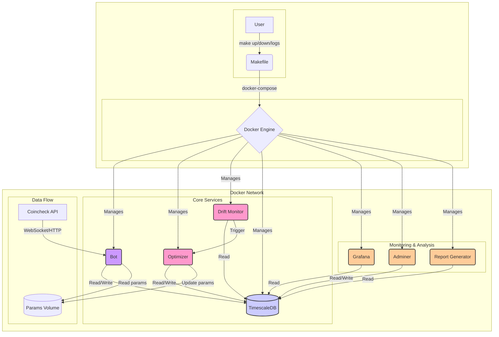

# OBI Scalp Bot

**OBI Scalp Bot**は、複数の市場マイクロストラクチャ指標をリアルタイムで分析し、高頻度なスキャルピング取引を行うGo言語製の取引ボットです。

Coincheck APIと連携し、Order Book Imbalance (OBI) を中心としつつ、Order Flow Imbalance (OFI), Cumulative Volume Delta (CVD) などの補助指標を組み合わせて、より精度の高い取引シグナルを生成します。

## アーキテクチャ概要

本システムは、複数のコンテナが連携して動作するマイクロサービスアーキテクチャを採用しています。各サービスは `docker-compose.yml` で定義されており、それぞれが特定の役割を担っています。



## サービス概要 (コンテナ一覧)

`docker-compose up` で起動するサービスは以下の通りです。

| サービス名         | コンテナ名                  | 役割                                                                                                                              |
| ------------------ | --------------------------- | --------------------------------------------------------------------------------------------------------------------------------- |
| `bot`              | `obi-scalp-bot`             | **取引ボット**: Goで実装されたメインのアプリケーション。市場データをリアルタイムで受信し、シグナルに基づいて取引を実行します。               |
| `optimizer`        | `obi-scalp-optimizer`       | **パラメータ最適化**: PythonとOptunaを使用。定期的に過去のデータを分析し、最適な取引パラメータ (`trade_config.yaml`) を算出・更新します。 |
| `drift-monitor`    | `obi-scalp-drift-monitor`   | **ドリフト監視**: パフォーマンスの劣化を監視し、`optimizer`の実行をトリガーします。                                                     |
| `timescaledb`      | `timescaledb-obi`           | **データベース**: 取引履歴、指標、損益などを保存する時系列データベース (PostgreSQL + TimescaleDB)。                                  |
| `grafana`          | `grafana-obi`               | **可視化ダッシュボード**: TimescaleDBのデータをグラフで表示し、パフォーマンスをリアルタイムで監視します。                               |
| `adminer`          | `adminer`                   | **DB管理ツール**: Web UIを通じてデータベースの内容を直接確認・操作できます。                                                          |
| `report-generator` | `report-generator`          | **レポート生成**: `make report` コマンドで実行され、指定期間のパフォーマンスレポートを生成します。                                    |
| `bot-simulate`     | `obi-scalp-bot-simulate`    | **シミュレーション実行**: `make simulate` で使用。過去データ(CSV)を使い、取引戦略のバックテストを高速に実行します。                  |
| `builder`          | -                           | **ビルド用**: Goアプリケーションをビルドするための一時的なコンテナです。                                                            |


## 主な特徴

-   **マルチ指標によるシグナル生成**:
    -   **OBI (Order Book Imbalance)**: 板情報の買い圧力と売り圧力の不均衡を捉えます。
    -   **OFI (Order Flow Imbalance)**: OBIに約定情報を加え、より市場の実態に近いフローを分析します。
    -   **CVD (Cumulative Volume Delta)**: 一定期間の買い約定と売り約定の差分を累積し、短期的なトレンドの勢いを測ります。
    -   **MicroPrice**: 最良気配値だけでは捉えきれない、板の厚みを考慮した実質的な価格を計算します。
-   **自律的なパラメータ最適化**: `drift-monitor`が市場の変化やパフォーマンスの劣化を検知し、`optimizer`が自動で最適な取引パラメータを再計算・適用します。
-   **リアルタイム処理**: CoincheckのWebSocket APIを利用して、リアルタイムに板情報・取引情報を取得し、遅延の少ないシグナル判断を実現します。
-   **堅牢なデータ永続化**: TimescaleDBに、取引履歴、板情報、計算した各種指標を効率的に保存・圧縮します。
-   **高速なバックテスト機能**: `bot-simulate`サービスにより、過去の市場データを用いた取引戦略の高速な検証が可能です。
-   **パフォーマンス可視化**: Grafanaと連携し、累積損益、勝率、取引履歴などを視覚的に分析できるダッシュボードを提供します。

## 技術スタック

-   **言語**: Go (Bot), Python (Optimizer)
-   **データベース**: TimescaleDB (PostgreSQL + TimescaleDB拡張)
-   **可視化**: Grafana
-   **コンテナ化**: Docker, Docker Compose
-   **主要ライブラリ**: Optuna (Python), Gorilla WebSocket (Go), Zap (Go)

## セットアップ

### 前提条件

-   Docker および Docker Compose がインストールされていること
-   `make`コマンドが利用できること

### 1. リポジトリのクローン

```bash
git clone https://github.com/your-org/obi-scalp-bot.git
cd obi-scalp-bot
```

### 2. 環境変数の設定

`.env.sample` ファイルをコピーして `.env` ファイルを作成し、必要な情報を設定します。

```bash
cp .env.sample .env
```
`.env`ファイルの中身を編集してください。

```
# Coincheck API
COINCHECK_API_KEY="YOUR_API_KEY"
COINCHECK_API_SECRET="YOUR_API_SECRET"

# Database
DB_USER="your_db_user"
DB_PASSWORD="your_db_password"
DB_NAME="obi_scalp_bot_db"

# Grafana
GRAFANA_USER="admin"
GRAFANA_PASSWORD="admin"
```

### 3. 設定ファイルについて

本プロジェクトの設定は、役割に応じて2つのファイルに分割されています。

-   `config/app_config.yaml`: **アプリケーション全体に関する設定**
    -   データベース接続情報、ログレベル、リプレイモードの設定など、システム全体の動作に関わるパラメータを管理します。
    -   通常、一度設定した後は頻繁に変更する必要はありません。
-   `/data/params/trade_config.yaml`: **取引戦略に関する設定**
    -   取引ペア、OBI閾値、利食い・損切り幅、ポジションサイズなど、ボットの売買ロジックに直接関わるパラメータを管理します。
    -   このファイルは、`optimizer`サービスによって自動的に更新されます。手動で編集する代わりに、`config/trade_config.yaml.template` のパラメータ範囲を調整してください。

## 実行コマンド (Makefile)

よく使われる操作は `Makefile` にまとめられています。

| コマンド                | 説明                                                                                                 |
| ----------------------- | ---------------------------------------------------------------------------------------------------- |
| `make up`               | すべてのサービス（取引ボット、最適化、監視等）を起動します。                                          |
| `make down`             | すべてのサービスを停止します。                                                                       |
| `make logs`             | 実行中の全サービスのログを表示します。`make logs service=bot` のようにサービス指定も可能です。     |
| `make monitor`          | ボットを起動せず、データベースとGrafanaのみを起動します。過去の取引結果を分析する際に使用します。    |
| `make report`           | コンソールに現在のパフォーマンスサマリーを表示します。                                               |
| `make optimize`         | 手動でパラメータ最適化を一度だけ実行します。                                                         |
| `make simulate`         | `CSV_PATH`で指定した過去データを用いてバックテストを実行します。                                     |
| `make export-sim-data`  | バックテスト用のデータをDBからエクスポートします。`HOURS_BEFORE=24` のように時間を指定します。       |
| `make test`             | Goのユニットテストを実行します。                                                                     |
| `make build`            | ローカルでGoのバイナリをビルドします。                                                               |


## バックテスト (シミュレーション)

過去の市場データ(CSV)を用いて取引戦略のパフォーマンスを高速に検証します。

### ステップ1: バックテスト用データの準備

データベースに保存されている過去の取引データをCSVファイルとしてエクスポートします。

```bash
# 直近24時間分のデータをエクスポート
make export-sim-data HOURS_BEFORE=24

# 期間指定でエクスポート
make export-sim-data START_TIME='2024-07-01 00:00:00' END_TIME='2024-07-01 03:00:00'
```
成功すると `./simulation/` ディレクトリに `order_book_updates_YYYYMMDD-HHMMSS.zip` のようなZIPファイルが生成されます。

### ステップ2: シミュレーションの実行

`make simulate` コマンドでバックテストを開始します。`CSV_PATH`には、ステップ1で作成したZIPファイルのパスを指定します。

```bash
make simulate CSV_PATH=./simulation/order_book_updates_YYYYMMDD-HHMMSS.zip
```
結果はコンソールに出力されます。この結果を元に `config/trade_config.yaml` のパラメータを調整し、再度シミュレーションを繰り返すことで戦略を最適化します。


## 自律的ハイパーパラメータ最適化

`drift-monitor` と `optimizer` の2つのサービスが連携し、市場の変化に適応するために取引パラメータを自律的に最適化します。

### 仕組み

1.  **ドリフト検知 (`drift-monitor`)**:
    -   リアルタイムの取引パフォーマンスを常時監視し、パフォーマンス低下や市場の急変動を検知すると、最適化プロセスを起動します。
2.  **パラメータ最適化 (`optimizer`)**:
    -   `optimizer`が起動し、`Optuna`を用いて最適なパラメータを探索します。
    -   見つかったパラメータが検証用データで一定の基準を満たした場合のみ、新しい設定ファイル (`/data/params/trade_config.yaml`) を生成します。
3.  **パラメータの動的リロード**:
    -   稼働中の `bot` サービスは、設定ファイルが更新されると自動的に検知し、取引を中断することなく新しいパラメータを即座に取引戦略に反映させます。

手動で最適化をトリガーする場合は `make optimize` を実行します。


## 監視・分析

### Grafanaダッシュボード

`make up` または `make monitor` を実行後、ブラウザで http://localhost:3000 にアクセスします。
`.env` で設定したユーザー名とパスワードでログインしてください（デフォルト: admin/admin）。

### Adminerによるデータベース閲覧

`make up` または `make monitor` を実行後、ブラウザで http://localhost:8888 にアクセスすると、Adminerの管理画面が開きます。
以下の情報でデータベースに接続できます。

-   **System**: `PostgreSQL`
-   **Server**: `timescaledb`
-   **Username**: (`.env`で設定した`DB_USER`)
-   **Password**: (`.env`で設定した`DB_PASSWORD`)
-   **Database**: (`.env`で設定した`DB_NAME`)

## 最適化におけるIS/OOSリトライ機構

本システムは、パラメータの過剰最適化（オーバーフィッティング）を抑制し、より頑健なパラメータセットを発見するため、In-Sample (IS) と Out-of-Sample (OOS) のデータを用いたウォークフォワード最適化を行います。

### 課題
- IS期間で最も成績の良かったパラメータが、OOS期間では通用しない（カーブフィッティング）リスクがありました。
- OOS検証で不合格となった場合、すぐに次の最適化サイクルが開始され、計算コストが増大する傾向がありました。

### リトライ機構の導入
この課題を解決するため、ISで優秀だったパラメータ群を複数検証するリトライ機構を導入しました。

1. **ISランキング**: IS期間での最適化完了後、Pareto-optimal（パレート最適）な解の中から、Profit FactorとSharpe RatioのZ-scoreを合計したスコアに基づき、上位のパラメータセットをランキング化します。
2. **OOS逐次検証**: ランキング1位のパラメータセットから順にOOSデータでバックテストを行います。
3. **採用と停止**:
    - OOSの成績が所定の基準（PF > 1.2, SR > 0.5など）を満たした最初のパラメータセットを、本番採用のパラメータとして更新します。
    - 上位`5`個のパラメータセットを試しても合格しなかった場合、そのサイクルではパラメータを更新しません。
4. **早期停止**: OOS検証において、Sharpe Ratioが合格基準の`70%`を`2`回連続で下回るなど、著しくパフォーマンスが低い結果が続いた場合、それ以降のリトライを打ち切り、計算リソースの浪費を防ぎます。

この機構により、偶然ISに適合しただけのパラメータを避け、異なる市場局面でも安定した性能を発揮する可能性が高い、より信頼性のあるパラメータセットの選定が期待できます。

## 開発

### テストの実行

```bash
make test
```

### ローカルビルド

```bash
make build
```

**注意**: `docker` コマンドの実行に `sudo` が必要な環境では、`Makefile` が `sudo -E` を使用して環境変数を引き継ぐように設定されています。`sudo` なしで `docker` を実行できるユーザーは、`Makefile` 内の `sudo -E` を削除してください。
