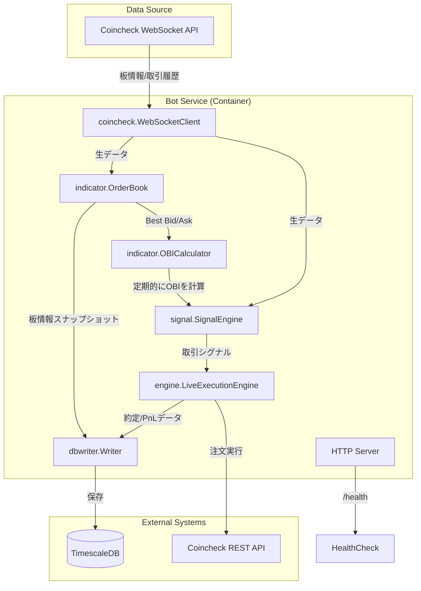

# 詳細設計書: botサービス

## 1. サービスの概要

`bot`サービスは、OBI (Order Book Imbalance) スキャルピング戦略を実行するために設計された、Go言語製の自動トレーディングボットである。

本サービスは、取引所（Coincheck）からリアルタイムの市場データ（板情報、取引履歴）をWebSocket経由で受信し、独自のアルゴリズムに基づいて取引シグナルを生成する。シグナルがトリガーされると、リスク管理チェックを経た上で、取引所のAPIを介して自動的に注文を実行する。

主な機能は以下の通り。

-   リアルタイムな市場データの受信と処理
-   複数の指標（OBI, OFI, CVD, マイクロプライス）を組み合わせた複合的な取引シグナルの生成
-   動的なパラメータ調整（ボラティリティに応じた閾値変更、相場レジーム判定）
-   厳格なリスク管理（最大ドローダウン、最大ポジションサイズ）
-   注文の実行、監視、タイムアウト処理
-   取引履歴、PnL（損益）、各種指標のデータベース（TimescaleDB）への永続化
-   ヘルスチェック用HTTPエンドポイントの提供
-   設定ファイルの動的リロード機能

また、本サービスはライブトレーディングモードの他に、過去のデータを用いたバックテストを行うためのシミュレーションモード、およびパラメータ最適化のためのサーバーモードも備えている。

## 2. docker-compose.yml上の役割と設定

`docker-compose.yml`において、`bot`サービスはトレーディング戦略を実行する主要なコンテナとして定義されている。

```yaml
services:
  # ... (other services)
  bot:
    build:
      context: .
      dockerfile: Dockerfile
    container_name: obi-scalp-bot
    volumes:
      - .:/app
      - ./.env:/app/.env:ro
      - ./data/params:/data/params
      - ./config:/app/config:ro
    entrypoint: ["/app/entrypoint.sh"]
    command: ["-config", "/app/config/app_config.yaml"]
    env_file:
      - .env
    environment:
      - DB_HOST=timescaledb
    ports:
      - "8080:8080" # Expose healthcheck port
    healthcheck:
      test: ["CMD", "curl", "-f", "http://localhost:8080/health"]
      interval: 30s
      timeout: 10s
      retries: 3
      start_period: 30s
    restart: unless-stopped
    depends_on:
      timescaledb:
        condition: service_healthy
      optimizer:
        condition: service_healthy
    networks:
      - bot_network
  # ... (other services)
```

### 設定項目の解説

-   **`build`**:
    -   リポジトリルートをコンテキストとし、`Dockerfile`を使用してイメージをビルドする。
-   **`container_name`**:
    -   コンテナの名前を `obi-scalp-bot` に設定する。
-   **`volumes`**:
    -   `.:/app`: ホストのカレントディレクトリ（プロジェクトルート）をコンテナの`/app`にマウントする。これにより、コードの変更が即座にコンテナに反映される。
    -   `./.env:/app/.env:ro`: 環境変数ファイル`.env`を読み取り専用でマウントする。APIキーなどの機密情報が含まれる。
    -   `./data/params:/data/params`: パラメータファイルを格納するディレクトリをマウントする。`optimizer`サービスが生成した`trade_config.yaml`がこのディレクトリに配置される。
    -   `./config:/app/config:ro`: アプリケーションの基本設定ファイル（`app_config.yaml`）を読み取り専用でマウントする。
-   **`entrypoint`**:
    -   コンテナ起動時のエントリポイントとして`/app/entrypoint.sh`スクリプトを指定する。このスクリプトは、`optimizer`サービスによって設定ファイルが生成されるのを待ってからメインのアプリケーションを起動する役割を持つ。
-   **`command`**:
    -   `entrypoint`スクリプトから呼び出されるメインアプリケーション（`/usr/local/bin/obi-scalp-bot`）に渡される引数。`-config`フラグでアプリケーション設定ファイルのパスを指定する。
-   **`env_file`**:
    -   `.env`ファイルを読み込み、コンテナ内の環境変数を設定する。
-   **`environment`**:
    -   `DB_HOST=timescaledb`: データベースホスト名を`timescaledb`に設定し、コンテナが同じDockerネットワーク上の`timescaledb`サービスに名前でアクセスできるようにする。
-   **`ports`**:
    -   `8080:8080`: コンテナのポート8080をホストのポート8080にマッピングする。これはヘルスチェック用のHTTPサーバーが使用する。
-   **`healthcheck`**:
    -   コンテナの正常性を定期的にチェックする。`http://localhost:8080/health`へのcurlリクエストが成功するかどうかで判断する。
-   **`restart`**:
    -   `unless-stopped`: 明示的に停止されない限り、コンテナが異常終了した場合に自動的に再起動する。
-   **`depends_on`**:
    -   `timescaledb`: `timescaledb`サービスが`healthy`状態になるまで`bot`サービスの起動を待機する。
    -   `optimizer`: `optimizer`サービスが`healthy`状態（＝`trade_config.yaml`の生成完了）になるまで`bot`サービスの起動を待機する。
-   **`networks`**:
    -   `bot_network`: `bot`サービスが属するDockerネットワーク。これにより、他のサービス（`timescaledb`, `optimizer`など）と通信できる。

## 3. 処理フローとアーキテクチャ

`bot`サービスの処理は、コンテナの起動からシグナルに基づく注文実行まで、一連の明確なフローに従って実行される。

### 3.1. 起動シーケンス

1.  **`entrypoint.sh`の実行**:
    -   コンテナが起動すると、まず`entrypoint.sh`が実行される。
    -   このスクリプトは、`optimizer`サービスによって取引パラメータが記述された設定ファイル（`/data/params/trade_config.yaml`）が生成されるのをポーリングして待機する。
    -   ファイルが確認できると、`exec`コマンドを用いてメインのGoアプリケーション（`/usr/local/bin/obi-scalp-bot`）に処理を移す。

2.  **`main.go`の初期化**:
    -   `main()`関数がアプリケーションのエントリーポイントとなる。
    -   コマンドラインフラグ（`-config`, `-simulate`, `-serve`など）を解析し、動作モードを決定する。
    -   `config.LoadConfig()`を呼び出し、`app_config.yaml`と`trade_config.yaml`を読み込んでアプリケーション全体の設定を初期化する。
    -   設定ファイルが変更された際に自動でリロードするためのウォッチャー（`fsnotify`）を起動する。
    -   ライブトレーディングモードの場合、`/health`エンドポイントを持つHTTPサーバーを起動し、DBライター（`dbwriter`）を初期化する。

### 3.2. メインループ（ライブトレーディングモード）

ライブトレーディングモードでは、複数のコンポーネントが並行して動作し、リアルタイムで市場を監視・取引する。



#### コンポーネントの役割

-   **`coincheck.WebSocketClient`**:
    -   CoincheckのWebSocket APIに接続し、`btc_jpy-orderbook`（板情報）と`btc_jpy-trades`（取引履歴）チャネルを購読する。
    -   受信した生データを対応するハンドラ（`OrderBookHandler`, `TradeHandler`）に渡す。
    -   接続が切れた場合、自動で再接続を試みる。

-   **`indicator.OrderBook`**:
    -   WebSocketから受信した板情報の差分更新（bids/asks）を適用し、常に最新の板状態をメモリ上に保持する。
    -   OBI（Order Book Imbalance）など、板情報に基づく指標計算の基礎となるデータを提供する。

-   **`indicator.OBICalculator`**:
    -   `OrderBook`を元に、設定された間隔（例: 300ms）で定期的にOBIを計算する。
    -   計算結果（`OBIResult`）をチャネル経由で`SignalEngine`に送信する。

-   **`signal.SignalEngine`**:
    -   アプリケーションの頭脳。OBI、OFI、CVD、マイクロプライスなど複数の指標をリアルタイムで受け取り、重み付けして複合スコアを算出する。
    -   複合スコアが設定された閾値（`CompositeThreshold`）を超えると、`LONG`または`SHORT`の取引シグナルを生成する。
    -   シグナルの信頼性を高めるため、ホールド期間、スロープフィルター、相場レジーム判定などのフィルタリングを適用する。

-   **`engine.LiveExecutionEngine`**:
    -   `SignalEngine`から取引シグナルを受け取ると、注文実行プロセスを開始する。
    -   **リスク管理**: 注文を実行する前に、現在のドローダウンやポジションサイズが設定された上限を超えていないか厳格にチェックする。
    -   **注文実行**: リスクチェックを通過すると、CoincheckのREST API経由で成行注文（Aggressive Order）を出す。
    -   **約定監視**: 注文後は取引履歴（`GetTransactions`）をポーリングし、自注文の約定を確認する。指定時間内に約定しない場合は注文をキャンセルする。
    -   **PnL計算**: 約定が確認されると、ポジションを更新し、実現損益（Realized PnL）を計算する。

-   **`dbwriter.Writer`**:
    -   各種データをTimescaleDBに永続化する責務を持つ。
    -   パフォーマンスへの影響を避けるため、データをバッチで非同期に書き込む。
    -   保存対象: 約定履歴、板情報更新、PnLサマリー、ベンチマークデータなど。

-   **HTTP Server (`http.handler`)**:
    -   ポート8080でリッスンし、`/health`エンドポイントを提供する。
    -   Dockerの`healthcheck`機能から呼び出され、コンテナの正常性を外部に通知する。

## 4. コアロジックの詳細解説

`bot`サービスの中核をなすのは、シグナル生成、注文実行、および指標計算の3つのロジックである。

### 4.1. シグナル生成 (`internal/signal/signal.go`)

`SignalEngine`は、市場の微細な変動を捉えて取引機会を見つけ出すための最も重要なコンポーネントである。

-   **複合スコア (`compositeScore`)**:
    -   単一の指標に依存するのではなく、複数の指標を重み付けして統合した「複合スコア」を用いてシグナルの判断を行う。
    -   `compositeScore = (obiValue * OBIWeight) + (ofiValue * OFIWeight) + (cvdValue * CVDWeight) + (microPriceDiff * MicroPriceWeight)`
    -   各指標の重み（`OBIWeight`など）は設定ファイルで調整可能であり、これにより戦略のカスタマイズが可能となる。

-   **シグナルのトリガー**:
    -   算出された`compositeScore`が、設定された閾値（`CompositeThreshold`）を上回った場合に**LONGシグナル**が、下回った場合に**SHORTシグナル**が生成される。

-   **高度なフィルタリング**:
    -   **動的OBI閾値 (`DynamicOBIConf`)**: 市場のボラティリティ（標準偏差で測定）が高いときは、誤ったシグナルを避けるためにOBIの閾値を自動的に引き上げる。逆にボラティリティが低いときは、より小さな変動を捉えるために閾値を引き下げる。
    -   **相場レジーム判定**: Hurst指数を用いて、現在の相場が**トレンド相場**（H > 0.55）か**平均回帰相場**（H < 0.45）かを判断する。トレンド相場では順張りが有効と判断してシグナル閾値を下げ、平均回帰相場では逆張りを狙うために閾値を上げる。
    -   **スロープフィルター (`SlopeFilter`)**: OBI時系列データの短期的な傾き（線形回帰で計算）を評価する。例えば、LONGシグナル候補が出てもOBIの傾きが下向きであれば、勢いが不足していると判断してシグナルを見送る。
    -   **ホールド期間 (`SignalHoldDuration`)**: ノイズによる瞬間的なスパイクで発注しないよう、シグナル状態が一定期間（例: 500ms）継続した場合にのみ、シグナルを「確定」させる。

### 4.2. 注文実行 (`internal/engine/execution_engine.go`)

`LiveExecutionEngine`は、生成されたシグナルを安全かつ確実に実行注文に移す役割を担う。

-   **リスク管理チェック**:
    -   注文を出す直前に、以下の項目をチェックする。これをクリアしない限り、注文は実行されない。
        1.  **最大ドローダウン**: 現在の損失額が、総資産に対して設定された許容ドローダウン率（`MaxDrawdownPercent`）を超えていないか。
        2.  **最大ポジションサイズ**: この注文によって保有するポジションの価値が、総資産に対して設定された最大比率（`MaxPositionRatio`）を超えないか。

-   **注文と約定監視**:
    -   リスクチェックを通過すると、Coincheck APIに**成行注文**（`rate`を指定するが、実質的には即時約定を狙うAggressive Order）を送信する。
    -   注文後、`GetTransactions`エンドポイントを定期的にポーリング（`PollIntervalMs`）し、自身の注文IDに紐づく約定履歴が現れるのを待つ。
    -   指定されたタイムアウト時間（`TimeoutSeconds`）内に約定が確認できない場合、その注文は市場から取り残された（stale）と判断し、`CancelOrder` APIを呼び出してキャンセルする。これにより、不利な価格での約定リスクを低減する。

-   **状態更新**:
    -   約定が確認されると、`position.Update()`を呼び出して現在のポジション（サイズと平均建値）を更新し、実現損益（Realized PnL）を計算する。
    -   計算されたPnLや約定履歴は、`dbwriter`を通じてデータベースに保存される。

### 4.3. OBI計算 (`internal/indicator/obi.go`)

OBI（Order Book Imbalance）は、板情報における買い圧力と売り圧力の不均衡を示す指標であり、このボットの戦略の根幹をなす。

-   **計算ロジック**:
    -   `OrderBook.CalculateOBI()`メソッド内で計算される。
    -   計算式: `OBI = (Bids - Asks) / (Bids + Asks)`
        -   `Bids`: 指定されたレベル（例: 8レベル）までの買い注文の合計数量
        -   `Asks`: 指定されたレベル（例: 8レベル）までの売り注文の合計数量
    -   結果は-1から+1の範囲に正規化され、+1に近いほど買い圧力が強く、-1に近いほど売り圧力が強いことを示す。

-   **実行タイミング**:
    -   `OBICalculator`によって、WebSocketで板情報が更新されるたびではなく、固定された時間間隔（`interval`）で計算される。これにより、計算負荷を平準化し、ノイズの多い板更新に過敏に反応することを防いでいる。

## 5. 設計思想と考慮点

本サービスの設計には、安定稼働とパフォーマンスを両立させるための様々な工夫が凝らされている。

-   **堅牢性とエラーハンドリング**:
    -   **WebSocket再接続**: `WebSocketClient`は、接続が切断された場合に備えて、指数バックオフ付きの再接続ロジックを持つ。
    -   **注文タイムアウト**: `LiveExecutionEngine`は、約定しない注文を自動的にキャンセルし、資金が拘束され続けるのを防ぐ。
    -   **APIエラー処理**: Coincheck APIからのエラーレスポンス（例: `{"success": false, "error": "..."}`）を適切にハンドリングし、ログに記録する。
    -   **グレースフルシャットダウン**: `os/signal`を捕捉し、アプリケーションが終了する前に進行中の処理を安全に完了させ、リソースを解放する仕組みを持つ。

-   **パフォーマンス**:
    -   **非同期DB書き込み**: `dbwriter`は、受け取ったデータをメモリ上のバッファに溜め、別ゴルーチンで非同期にデータベースへ書き込む。これにより、DB書き込みの遅延が取引ロジックのクリティカルパスに影響を与えるのを防ぐ。
    -   **インメモリ計算**: OBIや複合スコアなどの高頻度で更新される指標は、すべてメモリ上で計算される。DBへのアクセスは、データの永続化が必要な場合に限定される。
    -   **効率的なデータ構造**: 板情報を保持する`OrderBook`は、差分更新を効率的に適用できるよう最適化されている。

-   **設定の柔軟性と保守性**:
    -   **設定の分離**: アプリケーションの挙動を制御するパラメータ（APIキー、取引ロジックの閾値など）は、コードから分離されたYAMLファイル（`app_config.yaml`, `trade_config.yaml`）で管理される。
    -   **動的リロード**: `fsnotify`ライブラリを利用して設定ファイルの変更を監視し、検知した場合はアプリケーションを再起動することなく、設定を動的にリロードする。これにより、本番環境でのパラメータ変更が容易になる。

-   **セキュリティ**:
    -   **機密情報の分離**: APIキーやシークレットなどの機密情報は、`.env`ファイルに記述され、`docker-compose.yml`を通じて環境変数としてコンテナに渡される。これにより、機密情報がソースコードリポジトリにコミットされるのを防ぐ。

-   **テストとシミュレーション**:
    -   **モード分離**: `main.go`のフラグによって、ライブトレーディング（`!simulate`）、CSVファイルからのシミュレーション（`--simulate`）、最適化サーバー（`--serve`）の3つのモードを明確に切り替えられる。
    -   **インターフェースベースの設計**: `ExecutionEngine`がインターフェースとして定義されており、ライブ用の`LiveExecutionEngine`とシミュレーション用の`ReplayExecutionEngine`を差し替えることができる。これにより、同じシグナル生成ロジックを異なる実行環境でテストすることが可能になっている。

## 6. 想定ユースケースとトリガー条件

-   **想定ユースケース**:
    -   流動性の高いCoincheckのBTC/JPY市場において、マイクロ秒から秒単位で発生する短期的な価格変動（ミクロな非効率性）を捉え、小さな利益を積み重ねるスキャルピング戦略を実行する。
    -   `optimizer`サービスと連携し、定期的に市場データから最適な取引パラメータを再計算・適用することで、変化する市場環境に適応し続ける。

-   **トリガー条件**:
    -   全ての処理の起点は、**CoincheckのWebSocket APIから受信するリアルタイムな市場データ**である。
    -   板情報（orderbook）の更新、または取引履歴（trades）の更新が発生するたびに、`SignalEngine`が新しいデータで内部状態を更新し、複合スコアを再計算する。
    -   このスコアが設定された閾値を超え、かつ各種フィルター条件を満たした場合に、`LiveExecutionEngine`への注文実行がトリガーされる。
